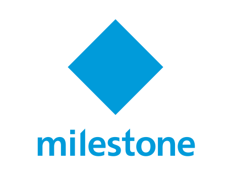

<!--   my-icons -->
<p align="center">
</a>
    <a href="https://github.com/Pr0xyG33k/Pr0xyG33k"></a>
    <a href="https://github.com/Pr0xyG33k/Pr0xyG33k/graphs/contributors">
    <a href="https://github.com/Pr0xyG33k/Pr0xyG33k/stargazers"></a>
    <a href="https://github.com/Pr0xyG33k/Pr0xyG33k/network/members"></a>
    <a href="https://github.com/Pr0xyG33k/Pr0xyG33k/issues"></a>
</p>

<!-- PROJECT LOGO -->
  <p align="center">
    <br />
    <a href="https://github.com/Pr0xyG33k/Milestone_XProtect02/issues">Report Bug</a>
    ·
    <a href="https://github.com/Pr0xyG33k/Milestone_XProtect02/pulls">Request Feature</a>
  </p>
</div>

<!--   my-ticker -->
<p align="center">
<a href="https://git.io/typing-svg"></a>
</p>

<!-- TABLE OF CONTENTS -->
<details>
  <summary>Table of Contents</summary>
  <ol>
    <li><a href="#about">about</a></li>
    <li><a href="#requirements">requirements</a></li>
    <li><a href="#usage">usage</a></li>
  </ol>
</details>

<!-- ABOUT -->
<h2>about</h2>
<div align="center">
 <br>
  
  
 <br>
</div>
<div align="center">
  <br>
  
   <h1>
   Integrate camera into.<br />
                XProtect Milestone.
  </h1>
  <br><br>
</div>

> Milestone_XProtect02.ps1 This PowerShell script utilizes the MilestonePSTools and ImportExcel modules to integrate cameras into a Milestone XProtect video management system. !

<!-- REQUIREMENTS -->
<h2>requirements</h2>

Clone the repository :
```powershell
git clone https://github.com/Pr0xyG33k/XProtect_Milestone02.git
```

Navigate to the project directory :
```powershell
cd XProtect_Milestone02/main
```

<!-- USAGE -->
<h2>usage</h2>

Execute the script :
```powershell
.\Milestone_XProtect02.ps1
```
